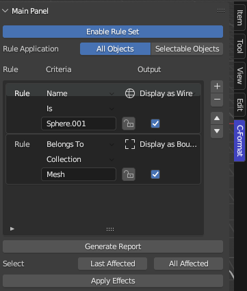
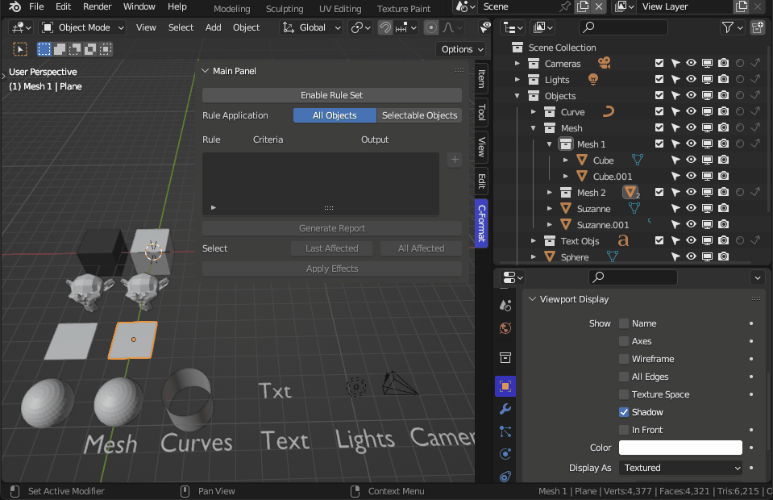
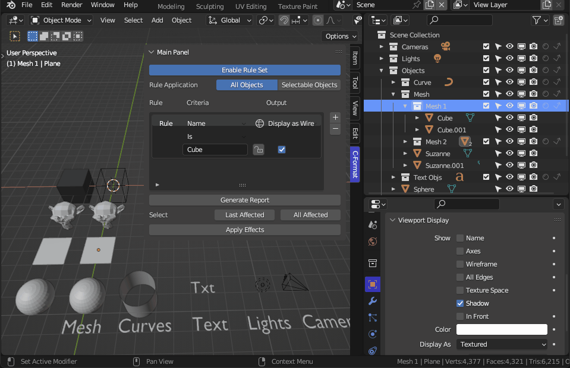
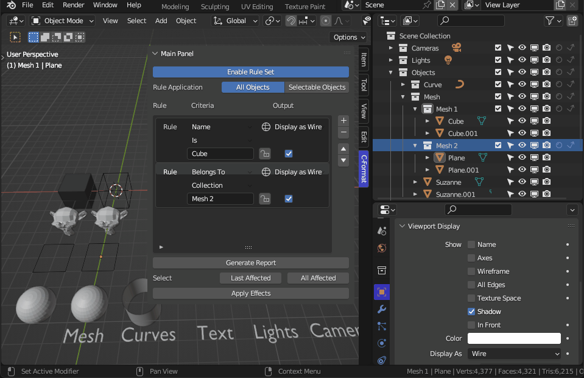
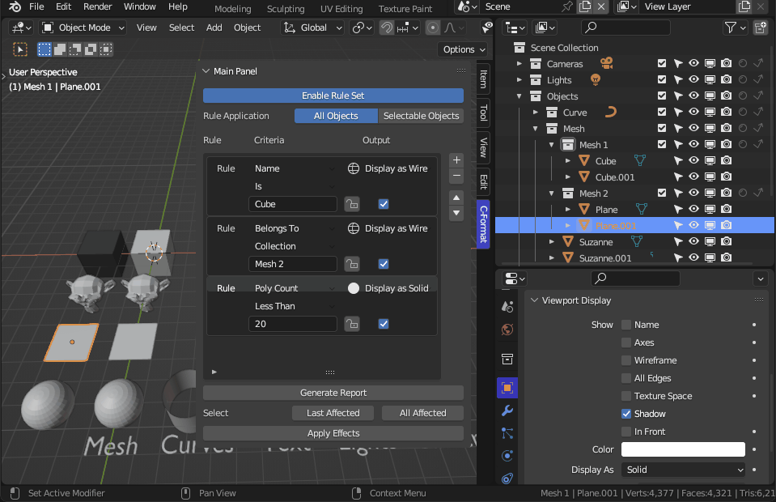
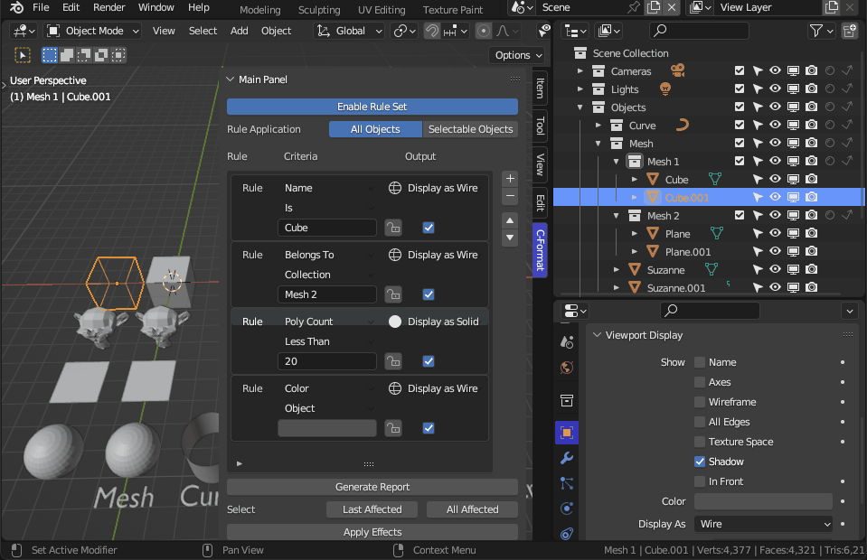
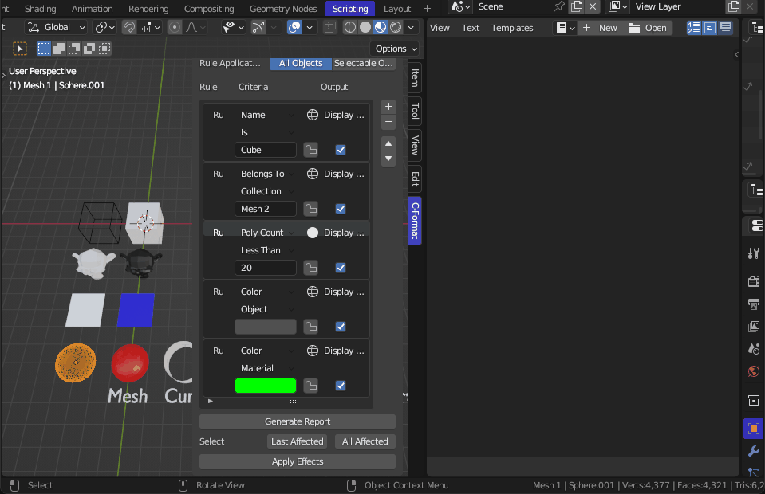
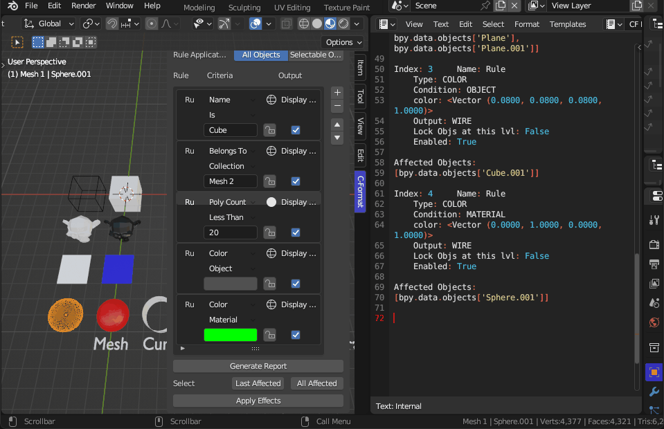
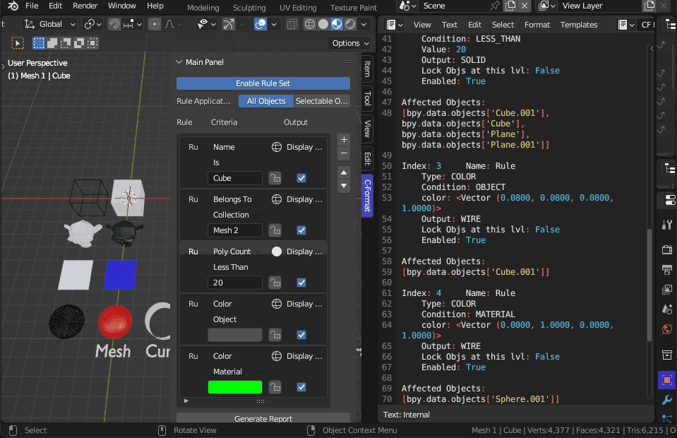

# Conditional Formatting:

Is a variation of @Salai_V_V1 Salai Vedha Viradhan concept and original work posted at:

[Blender Artist](https://blenderartists.org/t/conditional-formatting-in-blender/1479486)

[Git Hub](https://github.com/salaivv/blender-conditional-formatting/tree/main)

# Contents

* [Installation:](#installation)
* [Panel layout:](#panel-layout)
	* [Enable Rule Set](#enable-rule-set)
	* [Rule Application](#rule-application)
	* [UI List sub-panel](#ui-list-sub-panel)
	* [Generate Report](#generate-report)
	* [Set Selected](#set-selected)
	* [Apply Effects](#apply-effects)
* [Basic Operation](#basic-operation)
	* [Evaluate by Name](#evaluate-by-name)
	* [Evaluate Belongs to](#evaluate-belongs-to)
	* [Evaluate Poly Count](#evaluate-poly-count)
	* [Evaluate Color](#evaluate-color)
	* [Reporting](#reporting)
	* [Selecting](#selecting)
	* [Commiting](#commiting)
* [Known Issues:](#known-issues)
* [Change Log](#change-log)

# Installation:

* Download `.zip` file.
* From the `Edit` menu select `Preferences` > `Add-ons`.
* In the preferences panel select install and browse to the `ConditionalFormatting.zip` file.
* The add-on can be found in the `Community` section. Filtered on "3D View" (or "User" for blender 3.6.1)

[Back to Contents](#contents)

# Panel layout:

## Enable Rule Set
1. Used to establish an app handler for updating.
2. Used to store an initial status of all objects `context.object.display_type` {'BOUNDS', 'WIRE', 'SOLID', 'TEXTURED'} and `context.object.color` required for disabling rules to restore state.
3. Used as poll for operators.

## Rule Application

1. All Objects - Rules are applied to all objects in scene.
2. Selectable Objects - Rules are applied only to visible selectable objects in scene.

## UI List sub-panel

1. Operators:

    * `+` Add a new rule.
    * `-` Remove active rule.
    * &#8593; &#8595; Used to re-order active rule.
    
2. List of rules to follow in sequential order from top to bottom.

## Generate Report

1. Used to create text based report of rules and which objects are affected by each rule.

## Select

1. Last Affected - Select objects affected by last enabled rule.
2. All Affected - Select objects affected by all enabled rules.

## Apply Effects

1. Used to apply active rules. This will overwrite the stored state created when "Enable Rule Set" was applied allowing all existing rules to be removed or disabled.

[Back to Contents](#contents)

# Basic Operation

Each rule consists of:
* a rule name
* an evaluation type
* a condition to evaluate
* a value to compare
* an output display type to be set if an object meets the criteria
* a lock to exclude objects affected by the current rule from being affected by subsequent rules
* a check box to enable or disable a specific rule.

## Evaluate by Name

Select objects where `object.name` meets the criteria of condition and value.

## Evaluate Belongs to

Select objects in `data.collections.collection["value"].objects`

## Evaluate Poly Count

Select objects where `len(object.data.polygons)` meets the criteria of condition and value.

## Evaluate Color

1. Object - Select objects where `object.color` is equal to value.

2. Material - Select all objects where any material's diffuse_color in the objects material slots are equal to value.

## Reporting

1. Used to create text based report of rules and which objects are affected by each rule.

## Selecting

1. Last Affected - Select objects affected by last enabled rule.
2. All Affected - Select objects affected by all enabled rules.

## Commiting

1. Used to apply active rules. This will overwrite the stored state created when "Enable Rule Set" was applied allowing all existing rules to be removed or disabled.

[Back to Contents](#contents)

# Known Issues:

- changing an objects name does not force depsgraph update.
- setting an objects selectable state (object or collection) after a rule is applied does not force depsgraph update.
    - (work around toggle `Enable Rule Set` button)
    - (possible long term solution may be to subscribe to msg bus for changes but this may be too broad)

- if an object is added to the scene while the "Enable rule set" is active its stored state is that of the applied rules.
    - (work around disable `Enable Rule Set` button before adding objects to ensure original state is saved as unaffected by rules)

[Back to Contents](#contents)

# Change Log

v0.0.4a

Additional funtionality:

- input color (`context.object.color` or `context.object.material_slots[*any*].material.diffuse_color`) added to selection criteria.
- output color (`context.object.color`)
- added set selected operator (final affected objects become selected)
- added commit outputs operator (commit changes from outputs)
misc code cleaning (ongoing)

v0.0.3b

Bug Fixes

- When calling execute rule for reporting purposes rule was being applied regardless of being enabled. Added poll to report generation operator.

v0.0.3a

Additional funtionality:
- Added Lock at rule lvl

misc code cleaning (ongoing)

v0.0.3
- Modified upd_enable_single to be more flexible and applied to all PROPS_PG_ConditionalRule variables
- added limit to selectable objects

v0.0.2

Additional funtionality:
- Added recursive feature for collections
- Added Report generation for rules

misc code cleaning (ongoing)

Bug Fixes

- When removing the last rule of a list of rules the original display state wasn’t automatically being forced back to scene objects
- adding a belongs to collection rule was creating some background errors.
- initially adding a rule to check polygon count also should verify the value is numeric to avoid background errors